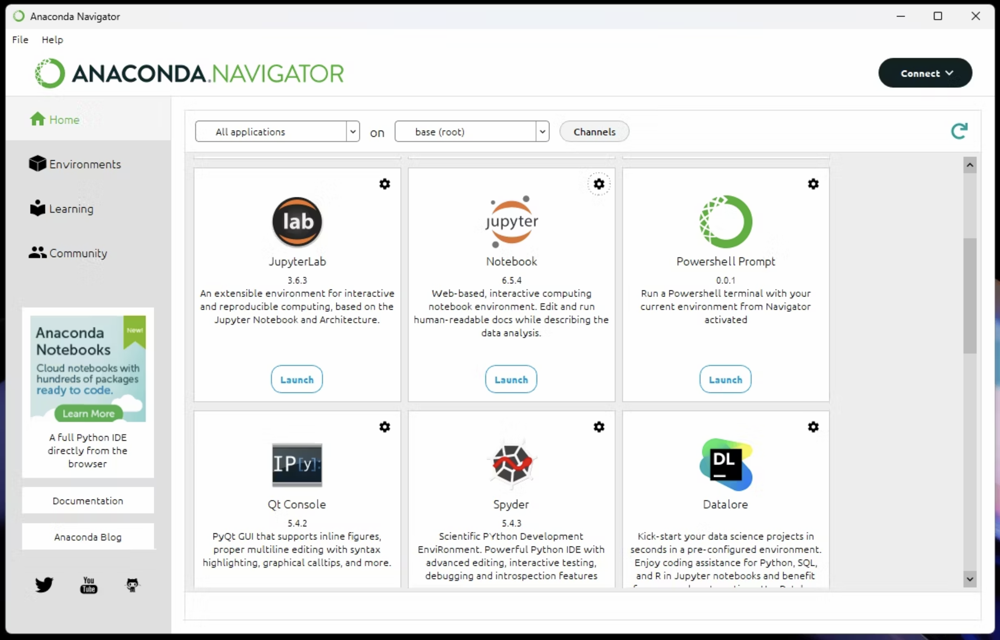

# Preparing Dev Environment for AI session

## 1. Google Colab

### 1.1 Introduction

I'm going to use Google Colab for this session. Google Colab, or Colaboratory, is a free Jupyter notebook environment that runs in the cloud. It allows you to write and execute code, run live code cells, and share your work with others. Colab is a popular tool for machine learning, data analysis, and education.

Here are some of the benefits of using Google Colab:

- It is free to use.
- It runs in the cloud, so you don't need to install any software on your computer.
- It can access powerful hardware, such as GPUs and TPUs.
- It is easy to share your work with others.
- It is a great way to learn about machine learning and data science.

### 1.2 Getting Started

**Prerequisites:**

- **You need a Google account to use Google Colab. So please create a one if you don't have one.**
- **Sign in to your Google account.**
  
1. Please visit:
https://colab.research.google.com/

2. Click, File -> Open Notebook
3. By clicking + Code, you can add a new code cell
4. To execute a code cell, click the play button on the left of the cell


Please check following video for more details:
https://www.youtube.com/watch?v=RLYoEyIHL6A

## 2. Local Development Environment

### Disclaimer:
**We not reponsible for any issues caused by installing software on your computer. Installing libraries may cause issues with your existing libraries and broken your existing environment. Please use your own judgement.**

In any case, for example if you want to use your own laptop for the session, you can use your local development environment. In this case, you need to install following software.

- Python 3.10
- Jupyter Notebook

Then you can install following libraries using pip.

```bash
!pip install pandas scikit-learn numpy matplotlib seaborn nltk wordcloud xgboost lightgbm
```

### 2.1 Windows

Easiest way to use Anaconda. Anaconda is a free and open-source distribution of the Python and R programming languages for scientific computing, that aims to simplify package management and deployment. Package versions are managed by the package management system conda.

1) Go to [Download Anaconda](https://www.anaconda.com/download#downloads) and download the installer for windows.
2) Follow the instructions to install Anaconda [Installation guide windpws](https://docs.anaconda.com/free/anaconda/install/windows/)
3) After installation, The app should start. If it doesn't search for it from your Start Menu to launch.
4) Ignore the prompt to log in.
5) Choose Jupyter Notebook from the list and press Launch. This will open a new tab in your default browser.

### 2.2 Mac

1) Go to [Download Anaconda](https://www.anaconda.com/download#downloads) and download the installer for Mac.
2) Follow the instructions to install Anaconda [Installation guide mac](https://docs.anaconda.com/free/anaconda/install/mac-os/)
3) After installation, The app should start. If it doesn't search for it from your Start Menu to launch.
4) Ignore the prompt to log in.
5) Choose Jupyter Notebook from the list and press Launch. This will open a new tab in your default browser.




There are many ways to install Python and Jupyter Notebook. You can use Anaconda, or you can use Docker. Please refer internet for more details.

---

**Note:**
This document is updated time to time. Please check the last updated date to see if there are any updates.

Last Updated: 2023/09/21
